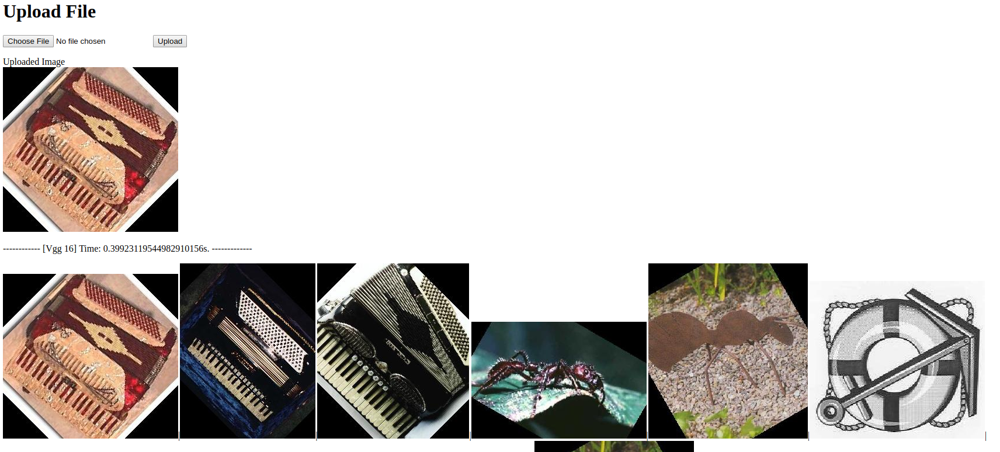

# Image Retrieval Engine Based on Keras



### Environment

* Anaconda 3
* [Faiss](https://github.com/facebookresearch/faiss)

### Quick start

* git clone https://github.com/duchengyao/flask-keras-cnn-image-retrieval.git
* cd flask-keras-cnn-image-retrieval
* python create_feature_database_keras.py
* CUDA_VISIBLE_DEVICES="" python app.py    # `CUDA_VISIBLE_DEVICES="" 为了屏蔽GPU`
* 访问 `http://127.0.0.1:19877/`

```sh
├── confg.py 配置文件
├── app.py flask demo
├── app_api_.py RESTful api
├── database 图像数据集
   ├── lctmimage.txt 图像数据库 ["ID" "base64"]
   └── test_base64.h5 上一个文件的图像特征[[vec],"ID]
├── extract_feat_***.py 使用预训练***模型提取图像特征
|── create_feature_database_keras.py 对图像集提取特征，建立索引
├── query.py 库内搜索
└── README.md
```

-------

下面的代码可以将当前目录的所有jpg文件转换成base64的txt文件

```
import os
import base64

abspath = os.path.abspath('.')
imlist = [f for f in os.listdir(abspath) if f.endswith('.jpg')]

with open(abspath+'/lctmimage.txt', 'w') as f:
    for img_name in imlist:
        img_file=open(abspath+'/'+img_name,'rb') #二进制方式打开图文件
        ls_f=str(base64.b64encode(img_file.read()))[2:-1] #读取文件内容，转换为base64编码
        
        img_file.close()
        f.write("\""+img_name+"\"\t\""+ls_f+"\"\n") #我也不知道为啥同事规定了这么个奇葩格式>_<
```